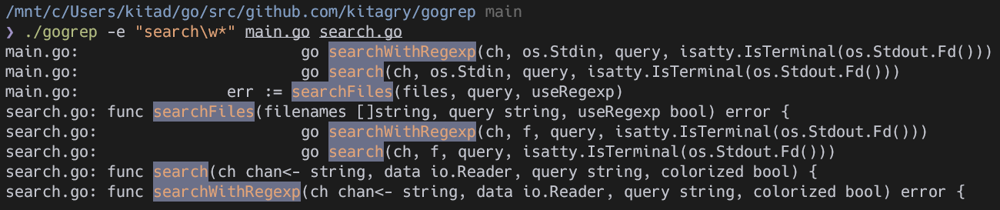

## gogrep

A toy `grep` implemented by golang.



### Usage

```
Usage of gogrep:
        gogrep [OPTION]... PATTERNS [FILE]...
  -e string
        use PATTERNS for matching
  -m int
        stop after NUM selected lines
  -v    select non-matching lines
```
